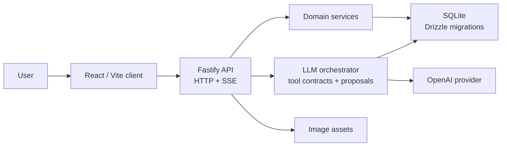

# Nutrition Coach

[繁體中文](README.md)

Nutrition Coach is an AI meal logging app. Users can log meals with text or photos; the backend uses an LLM to help estimate calories and macros, stores structured meal records, and streams processing status, results, and suggestions that need confirmation.

## Why this repo

- User problem: make meal logging with text or photos a low-friction entry point, then turn each entry into structured records that remain inspectable.
- Engineering thesis: use trustworthy LLM application engineering for the hard boundaries—typed contracts, confirm-first proposals, backend authority, committed receipts, and deterministic evidence.
- Verification path: the [30-minute reviewer tour](docs/tour.md) is the canonical Traditional-Chinese tour; this English README is its synchronized auxiliary entry, not a promise of a full English companion.

## Project Highlights

- Full-stack TypeScript app: React/Vite client, Fastify API, SQLite persistence.
- LLM application engineering: provider boundary, mockable `LLMProvider`, tool contract validation, fallback behavior.
- Stateful product flow: guest session, meal logging, history, correction, proposal approval.
- Engineering workflow: Node test suite, deterministic harness scenarios, GitHub Actions PR gate, release check.

## Core Features

- Log meals with text or photos and estimate calories, protein, carbs, and fat.
- Track daily targets, today's progress, meal list, history, and trends.
- Correct, delete, and revise meals through revision-safe update paths.
- Use proposal cards before AI suggestions mutate user data.
- Work without account signup through signed guest-session cookies.
- Stream chat status and results with SSE-style responses.

## Tech Stack

| Area | Technology |
|---|---|
| Frontend | React 19, Vite, Zustand, TypeScript |
| Backend | Fastify 5, TypeScript, Server-Sent Events |
| Database | SQLite, better-sqlite3, Drizzle ORM, Drizzle migrations |
| LLM | OpenAI SDK behind a local `LLMProvider` interface |
| Testing | Node built-in test runner, real SQLite, mock/harness LLM providers |
| CI | GitHub Actions PR check with `yarn pr:policy` and `yarn release:check` |
| Runtime | Local production-mode Fastify server, optionally exposed through Cloudflare Tunnel |

## Architecture



Main boundaries:

- `server/app.ts`: composes Fastify plugins, config, DB, services, realtime publisher, routes, and orchestrator dependencies.
- `server/routes/*.ts`: owns HTTP/SSE transport, request validation, guest-session checks, upload handling, and response shaping.
- `server/services/*.ts`: owns reusable domain logic and persistence logic.
- `server/orchestrator/*`: owns prompt construction, tool calls, mutation receipts, proposal behavior, and fallbacks.
- `server/llm/*`: owns the provider interface, OpenAI implementation, and mock providers.
- `client/src/api.ts`, `client/src/sse.ts`, and `client/src/store.ts`: own client transport and state boundaries.

More detail: [docs/architecture.md](docs/architecture.md)

## Local Development

Requirements:

- Node.js 22+
- Yarn
- OpenAI API key

Install dependencies:

```bash
yarn install
```

Create local environment:

```bash
cp .env.example .env
```

Set at least:

```bash
OPENAI_API_KEY=your-api-key-here
OPENAI_ORCHESTRATOR_MODEL=gpt-5.4-mini
PORT=3000
DB_PATH=./data/nutrition.db
TZ=Asia/Taipei
```

Initialize SQLite:

```bash
yarn db:migrate
```

Start with two terminals:

```bash
# Terminal 1: Fastify API server on http://localhost:3000
yarn dev:server

# Terminal 2: Vite client on http://localhost:5173
yarn dev:client
```

Open `http://localhost:5173`.

## Testing And Verification

Useful local checks:

```bash
yarn tsc --noEmit
yarn test:unit
yarn test:integration
yarn test
yarn build
yarn native:check
```

Pre-release check:

```bash
yarn release:check
```

Deterministic harness examples:

```bash
yarn verify:harness -- behavior-matrix
yarn verify:harness -- guest-session-hardening
yarn verify:harness -- provider-auth-failure-localization
```

`yarn release:check` verifies the `TZ=Asia/Taipei` runtime contract, TypeScript, the Node test suite, and frontend build. Tests use mocked or harness LLM providers; CI does not call the live OpenAI API.

`yarn native:check` is specialized native dependency evidence for Sharp upgrades, `better-sqlite3` upgrades, and v3.1 source-release review; it is not a replacement for `yarn release:check` and does not authorize production runtime refresh, Cloudflare Tunnel changes, public smoke, tag movement, or `main` promotion.

## Environment Variables

Common local variables:

| Variable | Purpose | Default |
|---|---|---|
| `OPENAI_API_KEY` | OpenAI key used by the backend provider | Required |
| `OPENAI_ORCHESTRATOR_MODEL` | Model used by the chat orchestrator | `gpt-5.4-mini` |
| `PORT` | Fastify server port | `3000` |
| `DB_PATH` | SQLite database path | `./data/nutrition.db` |
| `TZ` | Process timezone for nutrition day boundaries | `Asia/Taipei` |

Common production-like variables:

| Variable | Purpose | Default |
|---|---|---|
| `NODE_ENV` | Enables production-like runtime behavior when set to `production` | unset |
| `GUEST_SESSION_SECRET` | Guest-session cookie signing secret | local-dev default only |
| `ASSETS_DIR` | Persistent image asset directory | `./data/assets` |
| `UPLOADS_STAGING_DIR` | Request-local upload staging directory | `./data/uploads-staging` |
| `CLIENT_DIST_DIR` | Built frontend directory served by Fastify | `./dist/client` |

When `NODE_ENV=production`, `GUEST_SESSION_SECRET` must be present, non-default, and at least 32 characters.

## Deployment

Production mode serves the API and built frontend files from the same Fastify server.

Build and start the same-origin runtime:

```bash
yarn install --frozen-lockfile
yarn release:check
yarn build
yarn db:migrate
yarn start
```

Cloudflare Tunnel procedure: [docs/deploy/cloudflare-tunnel.md](docs/deploy/cloudflare-tunnel.md)

## Next Steps

- Split CI into clearer typecheck, tests, build, migration checks, and release policy jobs.
- Add manually triggered provider smoke checks with scoped secrets and sanitized artifacts.
- Improve observability around LLM failure categories without logging raw prompts or provider payloads.

## Related Docs

- [Architecture](docs/architecture.md)
- [Cloudflare Tunnel procedure](docs/deploy/cloudflare-tunnel.md)
- [ADR](docs/adr/)
