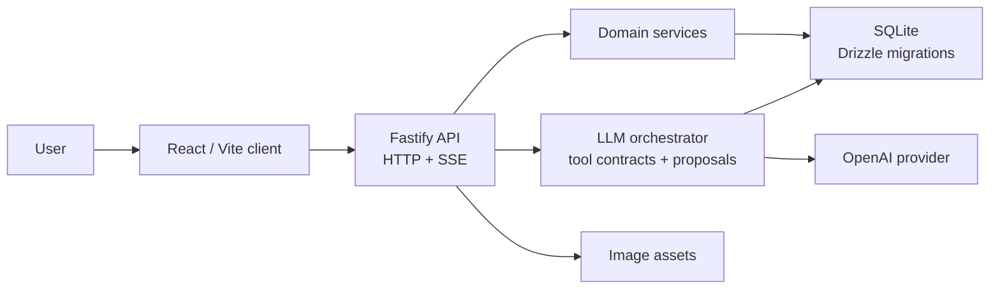

# Nutrition Coach

[English](README-en.md)

Nutrition Coach 是一個 AI 飲食紀錄應用。使用者可以用文字或照片記錄餐點；後端透過 LLM 輔助估算熱量與三大營養素，將結果寫入結構化紀錄，並用串流回覆顯示處理狀態、結果，以及需要使用者確認的建議。

## 為什麼做這個專案

- 使用者問題：讓文字或照片都能成為飲食紀錄的低摩擦入口，再由系統整理成可查詢的結構化資料。
- 工程主題：以可信賴的 LLM 應用工程處理真正困難的邊界，包含 typed contracts、confirm-first proposals、backend authority、committed receipts 與 deterministic evidence。
- 驗證路徑：[30 分鐘 reviewer tour](docs/reviewer-tour.md) 是繁體中文的 canonical tour；英文 README 是結構同步的 auxiliary entry，不代表另有完整英文導覽。

## 專案重點

- 全端 TypeScript 應用：React/Vite client、Fastify API、SQLite persistence。
- LLM 應用工程：provider boundary、可 mock 的 `LLMProvider`、tool contract validation、fallback behavior。
- 有狀態的產品流程：guest session、meal logging、history、correction、proposal approval。
- 工程流程：Node test suite、deterministic harness scenarios、GitHub Actions PR gate、release check。

## 核心功能

- 使用文字或圖片記錄餐點，估算 calories、protein、carbs、fat。
- 顯示每日目標、今日進度、餐點列表、歷史查詢與趨勢檢視。
- 支援餐點修正、刪除與 revision-safe updates。
- AI 建議若會改動資料，會先產生 proposal card，使用者確認後才寫入。
- 不需註冊帳號；同一個瀏覽器透過 signed guest-session cookies 保留狀態。
- Chat response 使用 SSE-style streaming，讓使用者看到處理狀態與結果。

## 技術棧

| 範圍 | 技術 |
|---|---|
| 前端 | React 19、Vite、Zustand、TypeScript |
| 後端 | Fastify 5、TypeScript、Server-Sent Events |
| 資料庫 | SQLite、better-sqlite3、Drizzle ORM、Drizzle migrations |
| LLM | OpenAI SDK，透過本地 `LLMProvider` interface 隔離 |
| 測試 | Node built-in test runner、real SQLite、mock/harness LLM providers |
| CI | GitHub Actions PR check，執行 `yarn pr:policy` 與 `yarn release:check` |
| 執行環境 | 本機 production-mode Fastify server，可透過 Cloudflare Tunnel 對外檢查 |

## 架構



主要邊界：

- `server/app.ts`：組裝 Fastify plugins、config、DB、services、realtime publisher、routes 和 orchestrator dependencies。
- `server/routes/*.ts`：負責 HTTP/SSE transport、request validation、guest-session checks、upload handling 和 response shaping。
- `server/services/*.ts`：放可重用的 domain logic 與 persistence logic。
- `server/orchestrator/*`：負責 prompt construction、tool calls、mutation receipts、proposal behavior 和 fallbacks。
- `server/llm/*`：放 provider interface、OpenAI implementation 和 mock providers。
- `client/src/api.ts`、`client/src/sse.ts`、`client/src/store.ts`：負責 client transport 與 state boundaries。

更完整說明：[docs/system-architecture.md](docs/system-architecture.md)

## 本機開發

需求：

- Node.js 22+
- Yarn
- OpenAI API key

安裝依賴：

```bash
yarn install
```

建立本機環境檔：

```bash
cp .env.example .env
```

至少設定：

```bash
OPENAI_API_KEY=your-api-key-here
OPENAI_ORCHESTRATOR_MODEL=gpt-5.4-mini
PORT=3000
DB_PATH=./data/nutrition.db
TZ=Asia/Taipei
```

初始化 SQLite：

```bash
yarn db:migrate
```

用兩個 terminal 啟動：

```bash
# Terminal 1: Fastify API server on http://localhost:3000
yarn dev:server

# Terminal 2: Vite client on http://localhost:5173
yarn dev:client
```

打開 `http://localhost:5173`。

## 測試與驗證

常用本機檢查：

```bash
yarn tsc --noEmit
yarn test:unit
yarn test:integration
yarn test
yarn build
yarn native:check
```

發布前檢查：

```bash
yarn release:check
```

Deterministic harness 範例：

```bash
yarn verify:harness -- behavior-matrix
yarn verify:harness -- guest-session-hardening
yarn verify:harness -- provider-auth-failure-localization
```

`yarn release:check` 會驗證 `TZ=Asia/Taipei` runtime contract、TypeScript、Node test suite、capability / behavior matrix generated-doc drift 與前端 build。測試使用 mocked 或 harness LLM providers；CI 不會呼叫 live OpenAI API。

v3.5 的 source/release 證據以 committed source SHA 為唯一來源；`workflow:state-check`、active planning artifact provenance/seal 與 `yarn release:check` 都不會推導 production/runtime、Cloudflare Tunnel、public smoke 或 subjective visual readiness。

`yarn native:check` 是 Sharp 與 `better-sqlite3` 升級、以及 v3.1 source-release review 的專用 native dependency evidence；它不是 `yarn release:check` 的替代，也不授權 production runtime refresh、Cloudflare Tunnel 變更、public smoke、tag movement 或 `main` promotion。

## 環境變數

常用本機變數：

| 變數 | 用途 | 預設值 |
|---|---|---|
| `OPENAI_API_KEY` | 後端 provider 使用的 OpenAI key | 必填 |
| `OPENAI_ORCHESTRATOR_MODEL` | chat orchestrator 使用的模型 | `gpt-5.4-mini` |
| `PORT` | Fastify server port | `3000` |
| `DB_PATH` | SQLite database path | `./data/nutrition.db` |
| `TZ` | 營養日邊界使用的 process timezone | `Asia/Taipei` |

類正式環境常用變數：

| 變數 | 用途 | 預設值 |
|---|---|---|
| `NODE_ENV` | 設為 `production` 時啟用類正式環境行為 | 未設定 |
| `GUEST_SESSION_SECRET` | guest-session cookie signing secret | 僅適合本機開發的預設值 |
| `ASSETS_DIR` | 持久化圖片資產目錄 | `./data/assets` |
| `UPLOADS_STAGING_DIR` | request-local upload staging directory | `./data/uploads-staging` |
| `CLIENT_DIST_DIR` | Fastify 提供的 built frontend directory | `./dist/client` |

當 `NODE_ENV=production` 時，`GUEST_SESSION_SECRET` 必須存在、不能使用預設值，且長度至少 32 個字元。

## 部署

Production-mode 會由同一個 Fastify server 提供 API 與建置後的前端檔案。

正式更新順序是：non-`main` branch 達到 PR-ready → PR policy／`Release Check` → maintainer 決定 merge 到 `main` → 從更新後的 `main` 完成 post-merge local archive → 另行核准 runtime refresh。PR、CI 或 closeout 都不會自動授權 production 操作；若 GSD workflow 暫停，不能跳過或偽造 archive。

v3.4.1 原五階段 runtime/demo 計畫已正式終止，保留一頁 [postmortem](docs/deploy/archive/v3.4.1-postmortem.md) 作為歷史證據；不恢復或繼續 Phase 114–118。後續 deployment authority 只保留三個 gate：source release、runtime safety and refresh、public validation。三個 gate 之下的 B01／R05／R06 與 named-Tunnel 步驟仍各自需要明確核准。

先在與刻意選定 merged source 相同 SHA、乾淨且未承載服務的 verification checkout 完成 source preflight；`release:check` 會執行 frontend build 並改寫 `dist/client`，所以不得在 active runtime checkout 執行。以下 command block 只表示 canonical ordering，不是合併的 approval bundle：

```bash
cd /absolute/path/to/clean-non-serving-verification-checkout
yarn install --frozen-lockfile
cp .env.example .env
yarn release:check
```

只有 source SHA、PR merge 與 post-merge archive 都重新驗證後，才可另行選定 active runtime checkout。在該 checkout 執行 `yarn db:migrate` 前，必須依 [Production storage recovery](docs/deploy/storage-recovery.md) 另行核准並完成 B01 quiesced backup／restore-readiness proof；R05 migration 與 R06 build/start 仍各自需要獨立核准，且 R06 才能改寫 runtime checkout 的 `dist/client`。

```bash
yarn db:migrate
yarn build
yarn start
```

Cloudflare Tunnel 流程：[docs/deploy/production-runtime.md](docs/deploy/production-runtime.md)

## 後續方向

- 將 CI 拆成更清楚的 typecheck、tests、build、migration checks 和 release policy jobs。
- 加入 manually triggered provider smoke checks，使用 scoped secrets 和 sanitized artifacts。
- 將 `release:check` 已採用的 allowlisted structured receipt 模式擴展到其他高風險流程；仍不記錄 raw prompts、child output 或 provider payloads。

## 相關文件

- [架構](docs/system-architecture.md)
- [Production storage recovery](docs/deploy/storage-recovery.md)
- [Cloudflare Tunnel 流程](docs/deploy/production-runtime.md)
- [ADR](docs/adr/)
