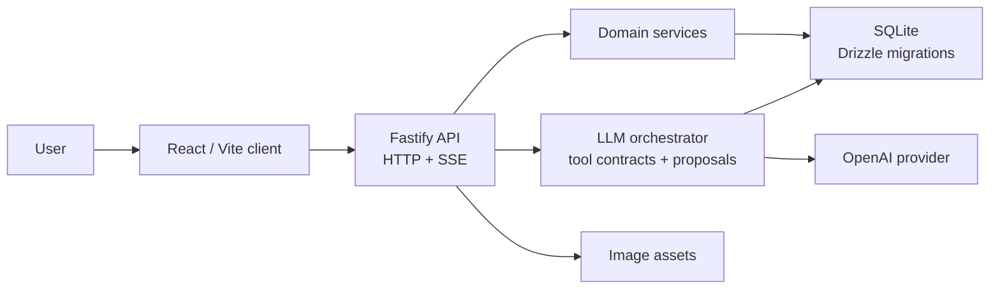

# Nutrition Coach

[English](README-en.md)

Nutrition Coach 是一個 AI 飲食紀錄應用。使用者可以用文字描述餐點，也可以上傳食物照片；系統會估算熱量與三大營養素，寫入結構化紀錄，並用串流回覆顯示處理狀態與結果。

## 功能

- 以文字或圖片記錄餐點，並估算熱量與三大營養素。
- 依照每日目標顯示今日進度、餐點列表與教練建議。
- 支援餐點修正、刪除、歷史查詢與趨勢檢視。
- 對會改動資料的 AI 建議採用確認後寫入的流程。
- 不需要註冊帳號；同一個瀏覽器會保留使用者的 guest session。

## Tech Stack

| Field | 技術 |
|---|---|
| Frontend | React 19, Vite, Zustand, TypeScript |
| Backend | Fastify 5, TypeScript, Server-Sent Events |
| DB | SQLite, better-sqlite3, Drizzle ORM, Drizzle migrations |
| LLM | OpenAI SDK，本地以 `LLMProvider` 隔離；測試使用 `MockLLMProvider` |
| CI | GitHub Actions PR check，執行 `yarn pr:policy` 與 `yarn release:check` |

## 架構



主要邊界

- `server/app.ts`：組裝 Fastify plugins、services、routes、realtime publisher 與 orchestrator。
- `server/routes/*.ts`：處理 HTTP/SSE 傳輸、request validation、session 檢查與回應整理。
- `server/services/*.ts`：放可重用的 domain logic 與 persistence logic。
- `server/orchestrator/*`：處理 prompt construction、tool execution、mutation receipts 與 fallback behavior。
- `server/llm/*`：放 OpenAI provider 與 mock provider。
- `client/src/store.ts`：前端狀態邊界。

## 本機執行

需求：

- Node.js 22+
- Yarn
- OpenAI API key

安裝依賴：

```bash
yarn install
```

建立本機環境檔：

```bash
cp .env.example .env
```

至少設定：

```bash
OPENAI_API_KEY=your-api-key-here
OPENAI_ORCHESTRATOR_MODEL=gpt-5.4-mini
PORT=3000
DB_PATH=./data/nutrition.db
TZ=Asia/Taipei
```

初始化 SQLite：

```bash
yarn db:migrate
```

用兩個 terminal 啟動開發環境：

```bash
# Terminal 1: Fastify API server on http://localhost:3000
yarn dev:server

# Terminal 2: Vite client on http://localhost:5173
yarn dev:client
```

打開 `http://localhost:5173`。

## 測試

```bash
yarn tsc --noEmit
yarn test:unit
yarn test:integration
yarn test
yarn build
```

PR 與 release gate：

```bash
yarn release:check
```

Deterministic harness scenarios：

```bash
yarn verify:harness -- behavior-matrix
yarn verify:harness -- guest-session-hardening
yarn verify:harness -- provider-auth-failure-localization
```

`yarn release:check` 會檢查 `TZ=Asia/Taipei` runtime contract、TypeScript、Node test suite 與前端建置。

## 環境變數

本機常用變數：

| 變數 | 用途 | 預設值 |
|---|---|---|
| `OPENAI_API_KEY` | 後端 provider 使用的 OpenAI API key | 必填 |
| `OPENAI_ORCHESTRATOR_MODEL` | Chat orchestrator 使用的模型 | `gpt-5.4-mini` |
| `PORT` | Fastify server port | `3000` |
| `DB_PATH` | SQLite database path | `./data/nutrition.db` |
| `TZ` | 每日營養邊界使用的 process timezone | `Asia/Taipei` |

部署或共用環境常用變數：

| 變數 | 用途 | 預設值 |
|---|---|---|
| `NODE_ENV` | 設為 `production` 時啟用類正式環境的 runtime 行為 | 未設定 |
| `GUEST_SESSION_SECRET` | App-owned guest-session cookie signing secret | 僅適合本機開發的預設值 |
| `ASSETS_DIR` | 持久化圖片資產目錄 | `./data/assets` |
| `UPLOADS_STAGING_DIR` | Request-local upload staging directory | `./data/uploads-staging` |
| `CLIENT_DIST_DIR` | Fastify serving 的 built frontend directory | `./dist/client` |

`NODE_ENV=production` 時，`GUEST_SESSION_SECRET` 不能缺失、使用預設值，或少於 32 字元。

## 部署

建置並啟動 same-origin Fastify server：

```bash
yarn install --frozen-lockfile
yarn release:check
yarn build
yarn db:migrate
yarn start
```

目前沒有固定公開 demo URL。本機完成 build 後，可以用 Cloudflare Tunnel 對外做公開檢查；流程見 [docs/deploy/cloudflare-tunnel.md](docs/deploy/cloudflare-tunnel.md)。

Source release 與 runtime refresh 是不同關卡：程式碼合併到 `main` 不代表 Cloudflare Tunnel 背後的 runtime 已經刷新。

## 文件

- [Cloudflare Tunnel runtime](docs/deploy/cloudflare-tunnel.md)
- [Capability matrix](docs/capability-matrix.md)
- [ADR 0001: Metadata-only LLM failure localization](docs/adr/0001-metadata-only-llm-failure-localization.md)
- [ADR 0002: Correction authority and meal intent](docs/adr/0002-correction-authority-and-meal-intent.md)
- [ADR 0003: Structured boundaries and authoritative state](docs/adr/0003-structured-boundaries-and-authoritative-state.md)
