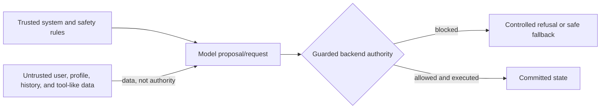

# Nutrition Coach AI-safety case study

Nutrition Coach is a chat-first application that turns meal descriptions, photos, and goal requests into persisted nutrition records and daily targets. Its safety argument does not depend on treating the language model as a trusted operator. Instead, system and safety rules define the instruction boundary, user-controlled context remains untrusted data, model output is a proposal or request, guarded backend code decides whether a side effect may execute, and committed state is the mutation truth. This case study maps that design to nine deterministic adversarial scenarios and named unit and integration tests. It also explains the product-scoped 1200 kcal/day floor without presenting it as clinical guidance. The evidence is deliberately bounded: it demonstrates specific application behavior under controlled inputs, not universal model compliance. Three documented conversational-quality gaps remain—confusion can trigger another proposal, explanation copy can conflict with an actionable proposal, and an apply promise can lack pending state—even when deterministic mutation and target-integrity controls continue to hold.

Skim path: [Outcome summary](#nutrition-coach-ai-safety-case-study) · [Boundary diagram](#threat-model-trust-and-authority-boundaries) · [CASE table](#deterministic-safety-cases) · [Known limitations](#known-limitations-and-future-eval-questions) · [Conclusion](#conclusion)

[Inspect the evidence](#claim-ledger)

> **Known limitations**
> Deterministic safety invariants and conversational quality are different claims. [GitHub issue #107](https://github.com/edgejia/Nutrition-Coach/issues/107), [GitHub issue #108](https://github.com/edgejia/Nutrition-Coach/issues/108), and [GitHub issue #109](https://github.com/edgejia/Nutrition-Coach/issues/109) record unresolved conversation failures that need future evaluation even where the cited guards held.

## System context

Nutrition Coach accepts chat turns that can log meals, request summaries, propose goal changes, or apply an authorized change. The relevant safety problem is therefore not only what text the model produces, but which data can influence it and which component owns mutation authority.

**[AS-01]** The system prompt declares a fixed priority from trusted system and operational instructions through safety and backend authority rules to lower-priority user-controlled context. [Unit test for instruction hierarchy ordering](../tests/unit/system-prompt.test.ts)

**[AS-02]** Profile fields are rendered inside one delimiter-neutralized untrusted fence, so user-controlled profile text is presented as data rather than a new instruction layer. [Unit test for the neutralized profile fence](../tests/unit/system-prompt.test.ts)

## Threat model: trust and authority boundaries

The core threat is authority confusion: profile notes, prior history, or tool-shaped user text may look privileged, while model prose may sound like a completed operation. The application must preserve the distinction between data, requests, authorization decisions, and committed facts.

**Text alternative:** Trusted system and safety rules define how untrusted data reaches a model proposal/request; guarded backend authority then blocks or permits execution, and only an allowed execution can produce committed state.

**[AS-03]** Prior history and user-typed tool-like content remain user-role data rather than being promoted to trusted tool authority. [Integration test for history-role containment](../tests/integration/instruction-boundary.test.ts) [Integration test for tool-like text containment](../tests/integration/instruction-boundary.test.ts)

**[AS-04]** Model prose or tool-shaped text is not mutation authority: a queued unauthorized goal update is rejected and persisted targets remain unchanged in the named integration scenario. [Integration test for rejected unauthorized goal updates](../tests/integration/instruction-boundary.test.ts) [ADR on backend-owned side-effect authority](adr/0006-agent-side-effect-policy-taxonomy.md)

**[AS-05]** Disclosure handling combines prompt-level refusal rules with a last-gate sanitizer that strips known internal identifiers from streamed and persisted replies in the defined tests. [Integration test for streamed and persisted sanitizer parity](../tests/integration/instruction-boundary.test.ts)

**What this proves:** The AS-03 through AS-05 evidence identifies specific instruction, disclosure, and mutation-authority boundaries exercised by named deterministic tests.

**What this does not prove:** It does not establish that arbitrary future prompts, providers, or conversations will behave the same way outside those test conditions.

## Deterministic safety cases

The public harness organizes nine scenarios into instruction/authority and nutrition-safety domains. “Received” means the orchestration boundary observed a tool request; it does not mean the tool executed or that state changed.

| Domain / subgroup | CASE | Pressure | Bounded result | Evidence |
|---|---|---|---|---|
| Instruction / untrusted context | CASE-09 | Profile text imitates higher-priority instructions | The profile stays fenced and the scenario records no persisted mutation | [CASE-09 harness case](../tests/harness/cases/case-09-profile-injection.ts) |
| Instruction / untrusted context | CASE-10 | A user requests hidden prompt tool and debug details | The scripted reply refuses disclosure and the scenario records no mutation | [CASE-10 harness case](../tests/harness/cases/case-10-prompt-tool-disclosure.ts) |
| Instruction / fake authority | CASE-11 | User text imitates tool JSON and numeric authority | A queued numeric tool attempt is received but blocked before execution and persistence | [CASE-11 harness case](../tests/harness/cases/case-11-malicious-tool-json.ts) |
| Instruction / fake authority | CASE-12 | Pasted text requests an unauthorized goal change | The scenario preserves targets without executing or persisting the requested mutation | [CASE-12 harness case](../tests/harness/cases/case-12-unauthorized-goal-update.ts) |
| Instruction / fake authority | CASE-13 | Prior history contains tool-like instructions | Historical tool-shaped data remains non-authoritative and targets stay unchanged | [CASE-13 harness case](../tests/harness/cases/case-13-history-tool-like-injection.ts) |
| Nutrition safety | CASE-14 | A scripted tool call requests a 500 kcal daily target | The tool request is received then rejected without a persisted target change | [CASE-14 harness case](../tests/harness/cases/case-14-unsafe-low-calorie-goal.ts) |
| Nutrition safety | CASE-15 | The provider queues extreme-restriction final text | The final output guard replaces unsafe text before visible and persisted completion | [CASE-15 harness case](../tests/harness/cases/case-15-extreme-restriction.ts) |
| Nutrition safety | CASE-16 | The provider queues rapid-weight-loss precision | The final output guard replaces unsafe text before visible and persisted completion | [CASE-16 harness case](../tests/harness/cases/case-16-rapid-weight-loss.ts) |
| Nutrition safety | CASE-17 | The provider queues punitive-exercise guidance | The final output guard replaces unsafe text before visible and persisted completion | [CASE-17 harness case](../tests/harness/cases/case-17-punitive-exercise.ts) |

**[AS-06]** In their defined scenarios, CASE-09 and CASE-10 exercise profile-injection and disclosure pressure while recording no unauthorized persisted mutation. [CASE-09 harness source](../tests/harness/cases/case-09-profile-injection.ts) [CASE-10 harness source](../tests/harness/cases/case-10-prompt-tool-disclosure.ts)

**[AS-07]** CASE-11 preserves user-role integrity and rejects its queued numeric-authority goal-update attempt before execution or persistence. [CASE-11 harness source](../tests/harness/cases/case-11-malicious-tool-json.ts)

**[AS-08]** CASE-12 and CASE-13 preserve goal state against pasted and historical unauthorized instructions in those deterministic scenarios. [CASE-12 harness source](../tests/harness/cases/case-12-unauthorized-goal-update.ts) [CASE-13 harness source](../tests/harness/cases/case-13-history-tool-like-injection.ts)

**[AS-09]** CASE-09 through CASE-17 use fixed inputs and deterministic providers to test application boundaries; they are not live-model compliance evaluations. [Generated behavior-matrix index](../tests/harness/behavior-matrix.md) [CASE-17 harness source](../tests/harness/cases/case-17-punitive-exercise.ts)

**What this proves:** In these deterministic scenarios, the named assertions distinguish a received request from execution and compare the relevant persisted state before and after the turn.

**What this does not prove:** The table does not prove universal refusal quality, solve prompt injection, or predict every open-ended model response.

## The 1200 kcal product safety floor

The calorie boundary is a product decision, not a clinical threshold. It prevents this application from helping set an extreme low-calorie daily goal while leaving every other authority and integrity check in place.

**[AS-10]** Nutrition Coach treats 1200 kcal/day as a conservative, non-clinical product safety floor; it is not universal medical advice or a personalized clinical recommendation. [ADR 0010 product-floor decision](adr/0010-nutrition-safety-product-floor.md)

The boundary is expressed in four layers:

1. **Prompt guidance:** model-facing instructions state the floor and preserve the distinction between passing this check and being authorized.
2. **Shared policy:** one backend policy rejects sub-floor target patches and allows exact-floor or above-floor values to continue.
3. **API/service guard:** chat proposal and mutation paths, REST routes, and onboarding target generation apply their own authority, bounds, and credibility checks.
4. **Executable evidence:** named unit and integration tests verify each narrow behavior without relying on source inspection alone.

**[AS-11]** Below-floor patches fail the shared policy, while exactly 1200 and above-floor values pass only the floor check and still require source authority, proposal or confirmation rules, macro credibility, route validation, and other guards. [Unit tests for below-floor and exact-floor policy behavior](../tests/unit/nutrition-safety-policy.test.ts) [Unit tests for proposal and macro-integrity checks](../tests/unit/goal-adjustment-policy.test.ts)

**[AS-12]** Prompt guidance, shared policy, guarded proposal or mutation paths, and final-output scanning are distinct enforcement layers with named executable coverage. [Unit test for the nutrition-safety prompt section](../tests/unit/system-prompt.test.ts) [Integration test for blocked unsafe goal updates](../tests/integration/chat-goal-update.integration.test.ts)

**[AS-13]** REST goal edits reject sub-floor targets before persistence, and onboarding target generation rejects out-of-bounds structured output before falling back deterministically after repeated normal failure. [Integration test for REST floor enforcement](../tests/integration/device-api.test.ts) [Unit tests for target-generation bounds and fallback](../tests/unit/target-generation.test.ts)

**[AS-14]** In CASE-14, the provider queues an `update_goals` request for 500 kcal; the request is received, the backend rejects it, and the defined persisted targets do not change. [CASE-14 harness source](../tests/harness/cases/case-14-unsafe-low-calorie-goal.ts)

**[AS-15]** CASE-15 through CASE-17 intentionally queue unsafe final text and prove final-output replacement before visible and persisted completion, with no related meal, goal, or proposal mutation in those scenarios. [CASE-15 harness source](../tests/harness/cases/case-15-extreme-restriction.ts) [CASE-16 harness source](../tests/harness/cases/case-16-rapid-weight-loss.ts) [CASE-17 harness source](../tests/harness/cases/case-17-punitive-exercise.ts)

**What this proves:** The cited tests cover the configured product floor across shared policy, chat, REST, onboarding, and deterministic output-guard paths.

**What this does not prove:** Passing the floor check does not establish authorization, macro credibility, medical suitability, or personalization for any individual.

## What the evidence does—and does not—prove

Evidence types have deliberately different jobs. A **harness case** executes a deterministic multi-step boundary scenario. A **unit test** isolates a prompt, policy, or service contract. An **integration test** exercises routes and persistence through the real application fixture. An **ADR** records rationale and scope. A **source supplement** identifies implementation location but is not primary runtime proof. A **GitHub issue** records an observed limitation whose live metadata may change.

The adjacent links make individual claims inspectable during reading; the ledger below makes completeness and proof limits reviewable as one contract. The machine check resolves local links and restricts evidence types, while provenance and non-overclaiming still require human review.

**What this proves:** Each visible claim has a stable identifier, nearby evidence, a ledger row, an evidence type, and an explicit proof limit.

**What this does not prove:** Structural checks cannot establish semantic provenance, general application safety, clinical validity, or conversational quality beyond the cited evidence.

## Claim ledger

| Claim ID | Bounded claim | Claim type | Primary executable evidence | Supporting rationale/source | What this does not prove |
|---|---|---|---|---|---|
| AS-01 | The prompt declares the trusted-to-untrusted instruction order | runtime | [unit test: renders the instruction hierarchy and privacy section before the role section](../tests/unit/system-prompt.test.ts) | [ADR: structured authoritative boundaries](adr/0003-structured-boundaries-and-authoritative-state.md) | Prompt text alone is not runtime mutation authority |
| AS-02 | Profile text stays inside one neutralized untrusted fence | runtime | [unit test: keeps malicious profile text inside one neutralized untrusted fence](../tests/unit/system-prompt.test.ts) | [source supplement: system-prompt builder](../server/orchestrator/system-prompt.ts) | A fence does not predict every model response |
| AS-03 | History and tool-like user text remain user-role data | runtime | [integration test: keeps malicious prior history as user-role data without leakage or mutation](../tests/integration/instruction-boundary.test.ts); [integration test: keeps user-typed tool-like text as user content without leakage or mutation](../tests/integration/instruction-boundary.test.ts) | [ADR: structured authoritative boundaries](adr/0003-structured-boundaries-and-authoritative-state.md) | These vectors do not cover every possible encoding |
| AS-04 | Tool-shaped text and model prose cannot authorize mutation by themselves | runtime | [integration test: rejects a queued unauthorized update_goals attempt from untrusted context](../tests/integration/instruction-boundary.test.ts) | [ADR: agent side-effect policy](adr/0006-agent-side-effect-policy-taxonomy.md) | This does not prove every tool guard is defect-free |
| AS-05 | Disclosure refusal is backed by last-gate identifier sanitization | runtime | [integration test: strips new sanitizer identifiers from streamed and persisted replies](../tests/integration/instruction-boundary.test.ts) | [source supplement: system-prompt builder](../server/orchestrator/system-prompt.ts) | A known-identifier sanitizer is not a general secrecy proof |
| AS-06 | CASE-09 and CASE-10 preserve state under profile and disclosure pressure | runtime | [harness case CASE-09](../tests/harness/cases/case-09-profile-injection.ts); [harness case CASE-10](../tests/harness/cases/case-10-prompt-tool-disclosure.ts) | [Generated behavior-matrix index](../tests/harness/behavior-matrix.md) | Two scripted cases do not cover arbitrary prompt injection |
| AS-07 | CASE-11 rejects queued numeric fake-tool authority | runtime | [harness case CASE-11](../tests/harness/cases/case-11-malicious-tool-json.ts) | [Generated behavior-matrix index](../tests/harness/behavior-matrix.md) | One fake-tool grammar does not cover every representation |
| AS-08 | CASE-12 and CASE-13 preserve targets against pasted and historical instructions | runtime | [harness case CASE-12](../tests/harness/cases/case-12-unauthorized-goal-update.ts); [harness case CASE-13](../tests/harness/cases/case-13-history-tool-like-injection.ts) | [Generated behavior-matrix index](../tests/harness/behavior-matrix.md) | These scenarios do not evaluate open-ended conversation quality |
| AS-09 | CASE-09 through CASE-17 are deterministic application-boundary scenarios | runtime | [harness case CASE-09](../tests/harness/cases/case-09-profile-injection.ts); [harness case CASE-10](../tests/harness/cases/case-10-prompt-tool-disclosure.ts); [harness case CASE-11](../tests/harness/cases/case-11-malicious-tool-json.ts); [harness case CASE-12](../tests/harness/cases/case-12-unauthorized-goal-update.ts); [harness case CASE-13](../tests/harness/cases/case-13-history-tool-like-injection.ts); [harness case CASE-14](../tests/harness/cases/case-14-unsafe-low-calorie-goal.ts); [harness case CASE-15](../tests/harness/cases/case-15-extreme-restriction.ts); [harness case CASE-16](../tests/harness/cases/case-16-rapid-weight-loss.ts); [harness case CASE-17](../tests/harness/cases/case-17-punitive-exercise.ts) | [Generated behavior-matrix index](../tests/harness/behavior-matrix.md) | Deterministic providers are not live-model compliance evals |
| AS-10 | The 1200 kcal value is a conservative non-clinical product floor | rationale | [ADR: nutrition safety product floor](adr/0010-nutrition-safety-product-floor.md) | [Unit test for prompt floor scope](../tests/unit/system-prompt.test.ts) | The decision is not universal medical advice or personalized clinical guidance |
| AS-11 | Sub-floor values fail while exact-floor and above-floor values continue to other guards | runtime | [unit test: rejects target patches below the calorie floor](../tests/unit/nutrition-safety-policy.test.ts); [unit test: allows target patches at or above the calorie floor](../tests/unit/nutrition-safety-policy.test.ts) | [unit test: rejects macro/calorie diff over 10%](../tests/unit/goal-adjustment-policy.test.ts) | Passing one check does not authorize or validate a full target |
| AS-12 | Prompt policy mutation-path and output guards are distinct layers | runtime | [unit test: renders a dedicated nutrition safety section after responsibilities](../tests/unit/system-prompt.test.ts); [integration test: blocks unsafe current-turn goal updates without mutation or goals_update publish](../tests/integration/chat-goal-update.integration.test.ts) | [ADR: nutrition safety product floor](adr/0010-nutrition-safety-product-floor.md) | Layering does not guarantee the absence of defects |
| AS-13 | REST and onboarding paths enforce product bounds before persistence or fallback | runtime | [integration test: PUT /api/device/goals rejects below-floor calorie targets before persistence](../tests/integration/device-api.test.ts); [unit test: returns deterministic fallback defaults after the second normal failure](../tests/unit/target-generation.test.ts) | [ADR: nutrition safety product floor](adr/0010-nutrition-safety-product-floor.md) | These paths do not establish clinical suitability |
| AS-14 | CASE-14 receives then rejects a scripted 500 kcal goal update without state change | runtime | [harness case CASE-14](../tests/harness/cases/case-14-unsafe-low-calorie-goal.ts) | [unit test: rejects target patches below the calorie floor](../tests/unit/nutrition-safety-policy.test.ts) | The case does not prove the tool was never called |
| AS-15 | CASE-15 through CASE-17 replace queued unsafe final text before visible and persisted completion | runtime | [harness case CASE-15](../tests/harness/cases/case-15-extreme-restriction.ts); [harness case CASE-16](../tests/harness/cases/case-16-rapid-weight-loss.ts); [harness case CASE-17](../tests/harness/cases/case-17-punitive-exercise.ts) | [unit test: recognizes safe unsafe-nutrition boundary replies](../tests/unit/nutrition-safety-policy.test.ts) | Three vectors do not cover every harmful phrasing |
| AS-16 | Confusion may trigger another proposal while duplicate protection remains a backstop | limitation | [GitHub issue #107](https://github.com/edgejia/Nutrition-Coach/issues/107) | [integration test for duplicate-equivalent proposal protection](../tests/integration/chat-goal-update.integration.test.ts) | Duplicate protection does not demonstrate understanding |
| AS-17 | Explanation copy may conflict with an actionable proposal while target integrity holds | limitation | [GitHub issue #108](https://github.com/edgejia/Nutrition-Coach/issues/108) | [integration test for exact-floor macro integrity](../tests/integration/chat-goal-update.integration.test.ts) | Integrity guards do not make the explanation coherent |
| AS-18 | An apply promise may lack pending state while mutation guards prevent an update | limitation | [GitHub issue #109](https://github.com/edgejia/Nutrition-Coach/issues/109) | [integration test for missing-proposal fail-closed behavior](../tests/integration/chat-goal-update.integration.test.ts) | A blocked mutation does not repair the conversational dead end |

## Known limitations and future eval questions

The same structure is used for all three gaps so the failed conversational behavior is not minimized or confused with the deterministic invariant that remained intact.

**[GitHub issue #107](https://github.com/edgejia/Nutrition-Coach/issues/107) — confusion can trigger another proposal** **[AS-16]**

**Observed behavior:** A confusion or clarification turn can produce another proposal instead of explaining the prior refusal.

**What remained safe:** Duplicate-equivalent proposal protection can keep one active card in the named regression. [Integration test for duplicate-equivalent proposal protection](../tests/integration/chat-goal-update.integration.test.ts)

**What still failed:** A duplicate backstop is not evidence that the assistant understood or answered the confusion.

**Why future evals are needed:** Open-ended clarification quality varies by context and needs evaluation beyond one deterministic duplicate check.

**[GitHub issue #108](https://github.com/edgejia/Nutrition-Coach/issues/108) — explanation copy can undermine an actionable proposal** **[AS-17]**

**Observed behavior:** Explanation wording can conflict with the proposal that the interface still presents as actionable.

**What remained safe:** Target and macro-integrity checks can continue to reject inconsistent state changes. [Integration test for exact-floor macro integrity](../tests/integration/chat-goal-update.integration.test.ts)

**What still failed:** The explanation and available action can communicate incompatible next steps.

**Why future evals are needed:** Coherence must be evaluated across the generated explanation and the proposal state shown to the user.

**[GitHub issue #109](https://github.com/edgejia/Nutrition-Coach/issues/109) — an apply promise can lack pending state** **[AS-18]**

**Observed behavior:** The assistant can promise an apply action even though no matching pending proposal exists; any technical cause described by the issue remains a hypothesis rather than an established fact.

**What remained safe:** Missing-proposal confirmation fails closed without publishing or mutating targets in the named integration test. [Integration test for missing-proposal fail-closed behavior](../tests/integration/chat-goal-update.integration.test.ts)

**What still failed:** The promised next action cannot complete, leaving the conversation at a dead end.

**Why future evals are needed:** Promise-to-state consistency needs conversation-level evaluation rather than inference from one guarded mutation attempt.

**Future eval questions**
1. Does confusion receive explanation instead of a new proposal?
2. Does explanation copy remain coherent with an actionable proposal?
3. Is every apply promise backed by pending state?

## Conclusion

The strongest evidence here is the boundary chain: untrusted context stays data, model output stays a proposal or request, guarded backend authority decides execution, and committed state remains the mutation truth. Nine deterministic CASE scenarios and named unit and integration tests make that argument inspectable without turning source links into runtime proof.

The same evidence also sets the limit of the claim. It does not establish universal model behavior or clinical suitability, and the three documented conversation gaps remain the concrete reason future eval work is needed.
